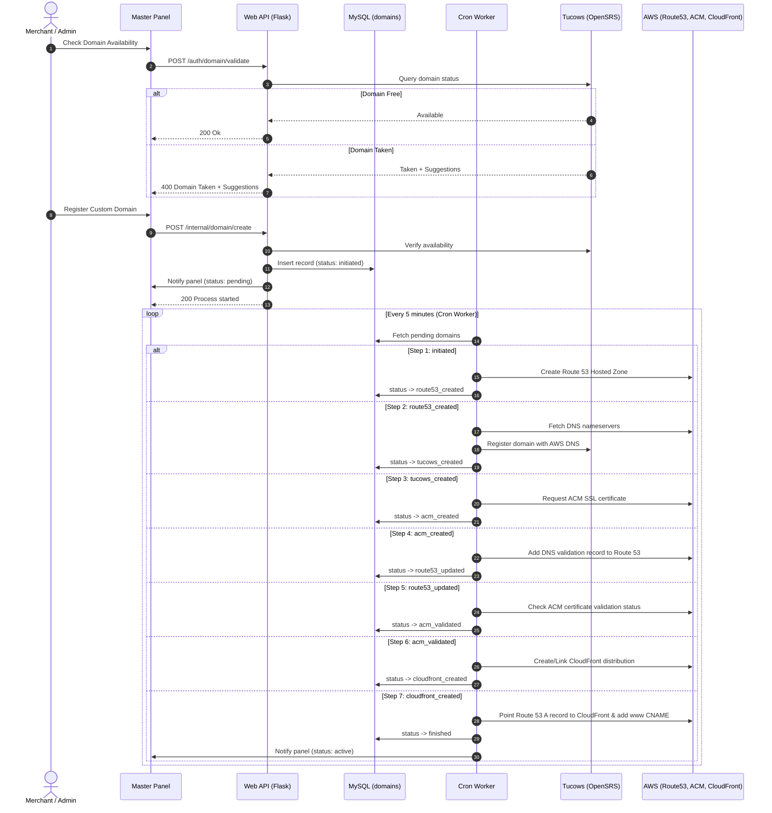

# Domain Registration Microservice (Multidomain)

A backend microservice for automated custom domain registration, DNS management, SSL provisioning, and CloudFront CDN integration for Host merchants.

---

## Table of Contents

- [Overview](#overview)
- [Architecture & Workflow](#architecture--workflow)
  - [Domain Lifecycle State Machine](#domain-lifecycle-state-machine)
  - [Sequence Diagram](#sequence-diagram)
- [API Reference](#api-reference)
  - [Health Check](#1-health-check)
  - [Validate Domain](#2-validate-domain)
  - [Create / Register Domain](#3-create--register-domain)
  - [Get Domain by Company](#4-get-domain-by-company)
  - [Update Domain Information](#5-update-domain-information)
- [Background Cron Worker](#background-cron-worker)
- [Configuration (.env)](#configuration-env)
  - [Tucows OpenSRS Environments](#tucows-opensrs-environments)
- [Database & Migrations](#database--migrations)
- [Getting Started](#getting-started)
  - [Local Development](#local-development)
  - [Running with Docker Compose](#running-with-docker-compose)
  - [Production Docker Build](#production-docker-build)
- [Project Structure](#project-structure)

---

## Overview

The **Domain Registration Microservice** automates the entire lifecycle of custom domain provisioning:
1. **Search & Availability**: Checks domain availability through Tucows OpenSRS API and returns suggestions if unavailable.
2. **Asynchronous Registration**: Persists registrant contact details and initializes multi-step background provisioning.
3. **AWS Infrastructure Automation**:
   - Sets up AWS Route 53 Hosted Zones and delegation name servers.
   - Registers domains on Tucows with AWS Route 53 DNS records.
   - Requests and verifies SSL certificates with AWS Certificate Manager (ACM) via DNS challenge.
   - Configures AWS CloudFront distributions pointing to the core application origin.
   - Creates root `A` alias records and `www` `CNAME` redirection.
4. **Status Reporting**: Continuously syncs registration lifecycle progress (`pending`, `active`, `failed`) back to the central panel.

---

## Architecture & Workflow

### Domain Lifecycle State Machine

The registration workflow is executed asynchronously by `src/cron.py`, iterating through sequential states stored in the `domains` table:

| State Value | Constant | Action Performed | Next State |
| :--- | :--- | :--- | :--- |
| `initiated` | `MULTIDOMAIN_STATE_INITIATED` | Creates AWS Route 53 Hosted Zone | `route53_created` |
| `route53_created` | `MULTIDOMAIN_STATE_CREATED_ROUTE53` | Retrieves AWS nameservers and registers domain in Tucows (OpenSRS) | `tucows_created` |
| `tucows_created` | `MULTIDOMAIN_STATE_CREATED_TUCOWS` | Requests SSL certificate in AWS Certificate Manager (ACM) | `acm_created` |
| `acm_created` | `MULTIDOMAIN_STATE_CREATED_ACM` | Adds ACM validation CNAME record to Route 53 | `route53_updated` |
| `route53_updated` | `MULTIDOMAIN_STATE_UPDATED_ROUTE53` | Checks validation status of the ACM SSL certificate | `acm_validated` |
| `acm_validated` | `MULTIDOMAIN_STATE_VALIDATED_ACM` | Configures CloudFront distribution with SSL certificate | `cloudfront_created` |
| `cloudfront_created` | `MULTIDOMAIN_STATE_CREATED_CLOUDFRONT` | Adds Route 53 A record (pointing to CloudFront) and www CNAME redirect | `finished` |
| `finished` | `MULTIDOMAIN_STATE_FINISHED` | Domain is active and routing traffic. Panel notified as `active`. | Terminal |
| `cancel` | `MULTIDOMAIN_STATE_CANCEL` | Domain creation cancelled or failed. Panel notified as `failed`. | Terminal |

### Sequence Diagram



---

## API Reference

Base URL: `http://localhost:5000`

### 1. Health Check

Verifies server status and database connectivity.

- **URL**: `/public/v1/health`
- **Method**: `GET`
- **Auth Required**: No

**Example Request**:
```bash
curl -X GET 'http://localhost:5000/public/v1/health'
```

**Success Response (200 OK)**:
```json
{
  "message": "Domain Registration service v1.0.0"
}
```

---

### 2. Validate Domain

Checks if a domain name is available for purchase. If unavailable, returns recommended domain suggestions.

- **URL**: `/auth/domain/validate`
- **Method**: `POST`
- **Headers**: `Content-Type: application/json`

**Request Body**:
```json
{
  "domain": "myrestaurant.com"
}
```

**Success Response (200 OK - Available)**:
```json
{
  "message": "Ok"
}
```

**Failure Response (400 Bad Request - Domain Taken)**:
```json
{
  "message": "Domain taken",
  "data": [
    "myrestaurant.net",
    "myrestaurant.org",
    "myrestaurant.online"
  ]
}
```

---

### 3. Create / Register Domain

Initiates the custom domain provisioning workflow.

- **URL**: `/internal/domain/create`
- **Method**: `POST`
- **Headers**: `Content-Type: application/json`

**Parameters**:

| Parameter | Type | Required | Description |
| :--- | :--- | :--- | :--- |
| `domain` | `string` | Yes | Target domain name (e.g. `restaurant.com`) |
| `company_id` | `string` | Yes | company / store identifier |
| `first_name` | `string` | Yes | Registrant first name |
| `last_name` | `string` | Yes | Registrant last name |
| `phone` | `string` | Yes | Phone number in international format (`+<country_code>.<number>`) |
| `fax` | `string` | Yes | Fax number (can match phone) |
| `email` | `string` | Yes | Registrant email address |
| `org_name` | `string` | Yes | Organization or business name |
| `address1` | `string` | Yes | Primary street address |
| `address2` | `string` | No | Secondary address / suite / interior |
| `address3` | `string` | No | Additional address line |
| `city` | `string` | Yes | City |
| `state` | `string` | Yes | 2-character state or province code |
| `country` | `string` | Yes | 2-character ISO country code (e.g. `PE`, `MX`, `US`, `BR`) |
| `postal_code` | `string` | Yes | Postal / ZIP code |
| `document_type` | `string` | No | Required for specific country TLDs (e.g. `CURP`, `CI`, `DNI`, `CUIT`) |
| `document_number` | `string` | No | Required for specific country TLDs (e.g. `CNPJ`, `DNI`) |

**Example Request**:
```bash
curl -X POST 'http://localhost:5000/internal/domain/create' \
  -H 'Content-Type: application/json' \
  -d '{
    "company_id": "COMP-00123",
    "domain": "restaurantexample.com",
    "first_name": "Juan",
    "last_name": "Carbajal",
    "phone": "+51.952713764",
    "fax": "+51.952713764",
    "email": "contact@restaurantexample.com",
    "org_name": "Restaurant Example",
    "address1": "Av. Larco 123",
    "address2": "Piso 4",
    "city": "Lima",
    "state": "LM",
    "country": "PE",
    "postal_code": "15074"
  }'
```

**Success Response (200 OK)**:
```json
{
  "message": "process started"
}
```

---

### 4. Get Domain by Company

Retrieves domain registration details and registrant information for a specific company ID.

- **URL**: `/auth/companies/<id>/domains`
- **Method**: `GET`

**Example Request**:
```bash
curl -X GET 'http://localhost:5000/auth/companies/COMP-00123/domains'
```

**Success Response (200 OK)**:
```json
{
  "message": "Ok",
  "data": {
    "company_id": "COMP-00123",
    "url": "restaurantexample.com",
    "status": "finished",
    "aws_r53_id": "/hostedzone/Z0123456789ABCDEF",
    "aws_acm_id": "arn:aws:acm:us-east-1:123456789012:certificate/uuid",
    "aws_clf_id": "EDFDVBD632BHDS5",
    "owner": {
      "first_name": "Juan",
      "last_name": "Carbajal",
      "phone": "+51.952713764",
      "email": "contact@restaurantexample.com"
    },
    "created_at": "2023-06-01 10:00:00",
    "updated_at": "2023-06-01 10:25:00",
    "release_date": "2023-06-01 10:25:00"
  }
}
```

---

### 5. Update Domain Information

Updates registrant contact information associated with a registered company domain.

- **URL**: `/auth/companies/<id>/domains`
- **Method**: `PUT`
- **Headers**: `Content-Type: application/json`

**Request Body**:
```json
{
  "first_name": "Juan",
  "last_name": "Carbajal",
  "phone": "+51.952713764",
  "fax": "+51.952713764",
  "email": "newemail@restaurantexample.com",
  "org_name": "Restaurant Example S.A.C.",
  "address1": "Av. Larco 456",
  "address2": "Oficina 201",
  "city": "Lima",
  "state": "LM",
  "country": "PE",
  "postal_code": "15074"
}
```

**Success Response (200 OK)**:
```json
{
  "message": "Ok"
}
```

---

## Background Cron Worker

The script `src/cron.py` orchestrates the domain provisioning lifecycle. In containerized environments, it is run automatically every 5 minutes by the system cron daemon:

- Reads domains with statuses different from `finished` and `cancel`.
- Advances each domain one step in the pipeline.
- Automatically handles exceptions and updates the `error` column in the database.
- Registers failure statuses with the panel if any step cannot be completed.

---

## Configuration (.env)

Create a `.env` file in the project root:

```env
# Application Settings
APP_VERSION=1.0.0
PORT=5000
ALLOWED_ORIGINS=*

# AWS Credentials (us-east-1 is required for ACM certificates used by CloudFront)
AWS_ACCESS_KEY=your_aws_access_key_id
AWS_SECRET_KEY=your_aws_secret_access_key

# Tucows (OpenSRS) Configuration
TUCOWS_RESELLER_USERNAME=your_tucows_username
TUCOWS_API_KEY=your_tucows_api_key
TUCOWS_API_HOST_PORT=https://horizon.opensrs.net:55443

# Master Registrant Defaults
MASTER_CLIENT_USER=default_client_user
MASTER_CLIENT_PASS=default_client_password
MASTER_CLIENT_DEFAULT_PERIOD=1
MASTER_DEFAULT_NAME=My Company
MASTER_DEFAULT_PHONE=+1.4000000000
MASTER_DEFAULT_EMAIL=info@mycompany.com

# Host CloudFront / Distribution Settings
MASTER_CLOUDFRONT_ID=your_distribution_id_or_elb
MASTER_CLOUDFRONT_DOMAINNAME=your_elb_domain_name
MASTER_CLOUDFRONT_TARGETORIGINID=your_target_origin_id

# Status Callback
PANEL_API_URL=https://api.mycompany.com

# Database Connection
DB_HOST=127.0.0.1
DB_PORT=3306
DB_DATABASE=db_multidomain
DB_USERNAME=root
DB_PASSWORD=your_password
```

### Tucows OpenSRS Environments

> [!IMPORTANT]
> In Tucows OpenSRS, you must whitelist the public IP address of the server making API requests in **Account Settings > API Key**. Requests from unwhitelisted IPs will be rejected.

- **Testing / Horizon Sandbox**:
  - URL: `https://horizon.opensrs.net:55443`
  - Portal: [https://opensrs.com/integrations/api/](https://opensrs.com/integrations/api/)
- **Production**:
  - URL: `https://rr-n1-tor.opensrs.net:55443`
  - Portal: [https://manage.opensrs.com](https://manage.opensrs.com)

---

## Database & Migrations

The service requires MySQL 5.7 or higher.

### Schema: `domains` Table

```sql
CREATE TABLE IF NOT EXISTS domains (
    company_id VARCHAR(255) PRIMARY KEY COMMENT 'Company identifier',
    url VARCHAR(64) UNIQUE NOT NULL COMMENT 'Domain URL',
    owner TEXT COMMENT 'Registrant owner JSON data',
    status VARCHAR(32) COMMENT 'Current step in provisioning process',
    renewal_type TINYINT UNSIGNED DEFAULT 1 COMMENT '0: disabled, 1: auto, 2: forced',
    release_date DATETIME COMMENT 'Timestamp when domain finished activation',
    aws_r53_id VARCHAR(255) COMMENT 'AWS Route 53 Hosted Zone ID',
    aws_acm_id VARCHAR(255) COMMENT 'AWS ACM Certificate ARN',
    aws_clf_id VARCHAR(255) COMMENT 'AWS CloudFront Distribution ID',
    error TEXT COMMENT 'Error log if step failed',
    created_at DATETIME DEFAULT NOW(),
    updated_at DATETIME DEFAULT NOW()
);
```

### Applying Migrations

SQL migration files are located in `migration/`. Run:

```bash
bash migration/migration.sh migration/
```

---

## Getting Started

### Local Development

1. **Clone the repository**:
   ```bash
   git clone https://gitlab.com/aitodev/qlickmenu/micro-services/domain-registration.git
   cd domain-registration
   ```

2. **Create Python virtual environment**:
   ```bash
   python3 -m venv venv
   source venv/bin/activate
   pip install -r requirements.txt
   ```

3. **Configure environment**:
   ```bash
   cp .env.sample .env  # or create .env using the template above
   ```

4. **Run the web API server**:
   ```bash
   python src/web.py
   ```

5. **Run the cron worker manually**:
   ```bash
   python src/cron.py
   ```

### Running with Docker Compose

To start both MySQL 5.7 and the web application container:

```bash
docker-compose up --build -d
```

- Web API will be available on `http://localhost:5000`
- MySQL will be exposed on port `3306`

### Production Docker Build

The root `Dockerfile` runs both the database migrations, cron daemon, and Flask web API:

```bash
docker build -t multidomain-service .
docker run -d \
  -p 5000:5000 \
  --name multidomain_app \
  --env-file .env \
  multidomain-service
```

---

## Project Structure

```
├── Dockerfile                  # Production container (migration + cron + web)
├── cron.Dockerfile             # Standalone cron worker container
├── web.Dockerfile              # Standalone web API container
├── docker-compose.yml          # Local orchestration (MySQL + Web)
├── requirements.txt            # Python dependencies
├── requirements_web.txt        # Web-specific dependencies
├── requirements_cron.txt       # Cron-specific dependencies
├── migration/                  # SQL migration scripts
│   ├── 05.sql
│   ├── 1.sql
│   ├── 2.sql
│   └── migration.sh            # Migration runner
├── prodfiles/                  # Production configurations
│   ├── crontab                 # Cron schedule
│   ├── run.sh                  # Container startup script
│   └── uwsgi.ini               # uWSGI configuration
├── doc/                        # Architecture & diagrams
│   ├── uml.plantuml            # Sequence UML diagrams
│   └── doc.html                # Detailed technical documentation
└── src/
    ├── web.py                  # Flask entrypoint & CORS setup
    ├── cron.py                 # Asynchronous domain provisioning worker
    ├── report.py               # Daily email status report script
    ├── routes/
    │   ├── __init__.py         # Blueprint initialization
    │   └── default.py          # REST API route handlers
    └── multidomain/
        ├── aws.py              # AWS Route53, ACM, and CloudFront integration
        ├── tucows.py           # Tucows OpenSRS XML protocol client
        ├── environment.py      # Dependency injection & config loader
        ├── statusrecorder.py   # Panel status reporter
        ├── constants.py        # Status string constants
        └── model/
            ├── domain.py       # Peewee ORM domain table & queries
            └── constants.py    # Provisioning state constants
```
